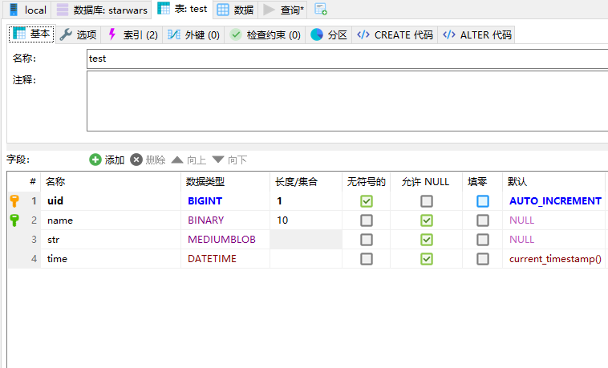
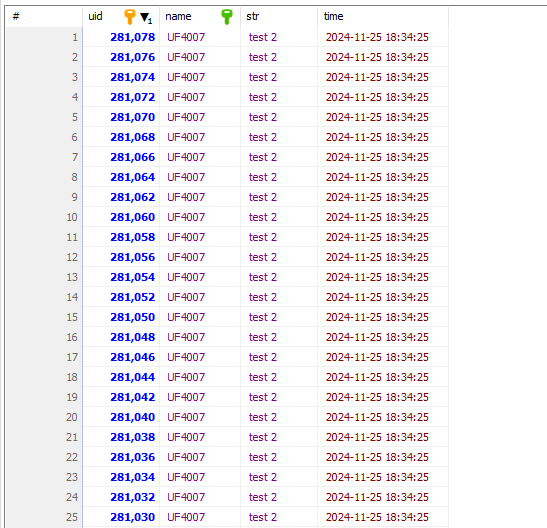

<div>
	<a style="text-decoration: none;" href="">
		
	</a>
	<a style="text-decoration: none;" href="">
		
	</a>
	<a href="https://github.com/UF4007/memManager/blob/main/License.txt">
		
	<a href="https://www.debian.org/">
		
</div>

# aMySQLbuf
async C++20 coroutine-based high-performance MySQL buffer library

Our advanced aMySQLbuf is totally beyond the old Redis.

### dependency:
- ioManager

- memManager

- mysql/mariadb develop environment

### control flow:
```C++
SQLThread                  	asql::table<struct, ...index>				MainThread(coroutine)
InstructionQueue			
...		<---query---	relative params (keep lifetime) <---detemplate--	table member method
...				|							task_await(coPromise)
...				|
async execute			|
async return	---result-->	coroutine wake			--------------->	get result
```
### data structure:
each 'index' template in the asql::table struct has a built-in hashmap.

### bind and corresponding C++ type name:
- TINYINT ---------------------------------> int8  
- SMALLINT --------------------------------> int16  
- INT -------------------------------------> int32  
- BIGINT ----------------------------------> int64  
- FLOAT -----------------------------------> float  
- DOUBLE ----------------------------------> double  
- BINARY ----------------------------------> char[]  
- MEDIUMBLOB ------------------------------> std::string series  
- DATETIME --------------------------------> MYSQL_TIME, via GWPP_SQL_TIME(),
  - use mem::memUnit::tp_to_SQL_TIME()/SQL_TIME_to_tp() to convert to std::chrono::system_clock::time_point
 
- **Be careful with the sequence between the fields in the MySQL table and the GWPP of save_fetch in the C++ struct!** 

you can load the /cppGenerate.sql procedure into your database to generate the cpp code automatically.

### demo
```C++
#include "aMySQLbuf/demo.h"
asql_testmain();
```
- MYSQL table structure:  

- MYSQL table rows:    


---EXPERIMENTAL LIBRARY---
